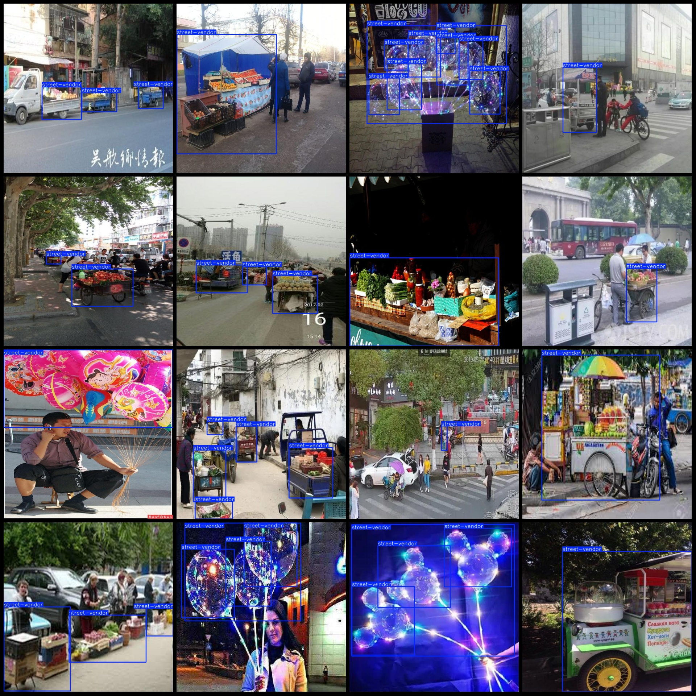
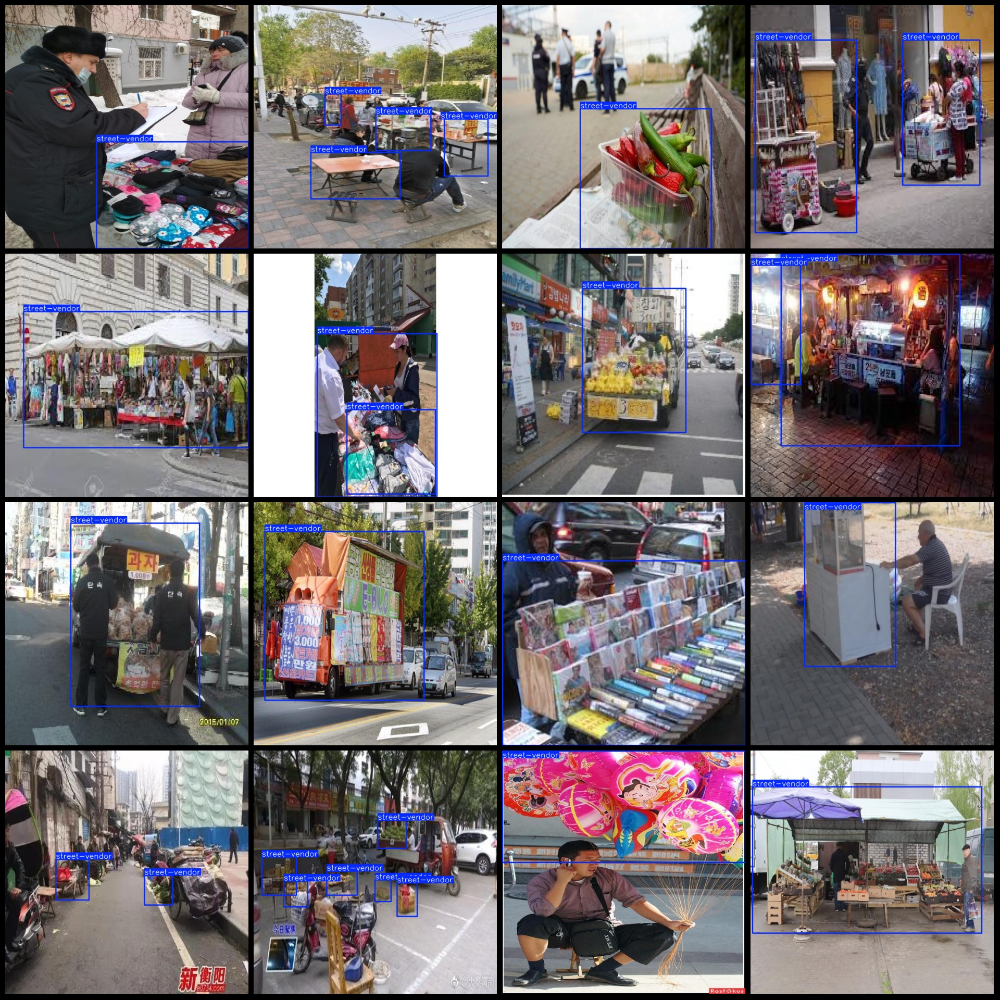

# Smart City Street Vendor Detection Dataset in Pascal VOC+YOLO Format
2401 Images, 1 Label

The dataset format is Pascal VOC format plus YOLO format (without the split path in txt files, only containing jpg images along with their corresponding VOC format xml files and YOLO format txt files).

Number of images (jpg file counts): 2401
Number of annotations (xml file counts): 2401
Number of annotations (txt file counts): 2401
Number of label categories: 1
Label category name: ["street-vendor"]
Number of bounding box instances per category:
- street-vendor: 4705
Total bounding box instances: 4705
Image resolution: 640x640
Annotation tool used: labelImg
Annotation rules: drawing bounding boxes for each category
Important note: The dataset does not have a training/validation/test split. You will need to manually divide it.
Special declaration: This dataset does not guarantee the accuracy of the trained models or weight files.
Image preview:

## Images

Here is a pay link on Stripe ( https://buy.stripe.com/3cs8yP7sY87d0vu9AB ). Please contact me lonlonago@foxmail.com after funding $89, and I will send you a complete data files , thank you!

